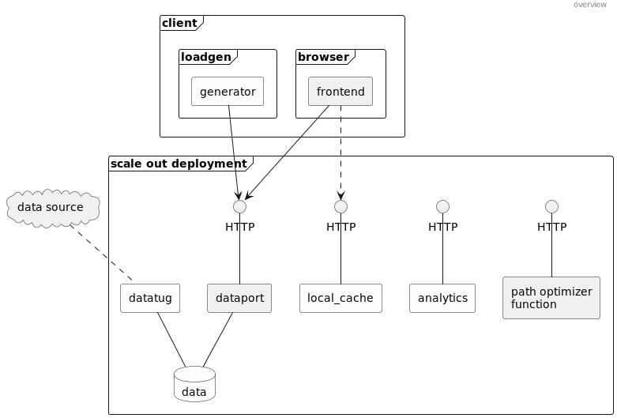

# Rusty port sample microservice.

**_Note_**: This is a work in progress project - use at your own risk.

This is an example microservice demo app written in 
[Rust](https://www.rust-lang.org/) for port optimization.

Plenty of example cloud native web application exist. But most of them mimic 
either [web shops](https://github.com/GoogleCloudPlatform/microservices-demo) 
or e.g. [social networks](https://github.com/delimitrou/DeathStarBench). Also, 
they are not implemented in Rust - time to change that :-) So this is a more 
"industrial" style microservice style deployment that can be deployed on 
e.g. Kubernetes. Below you see the overview of the individual services (Agents 
in white are not implemented yet.):

